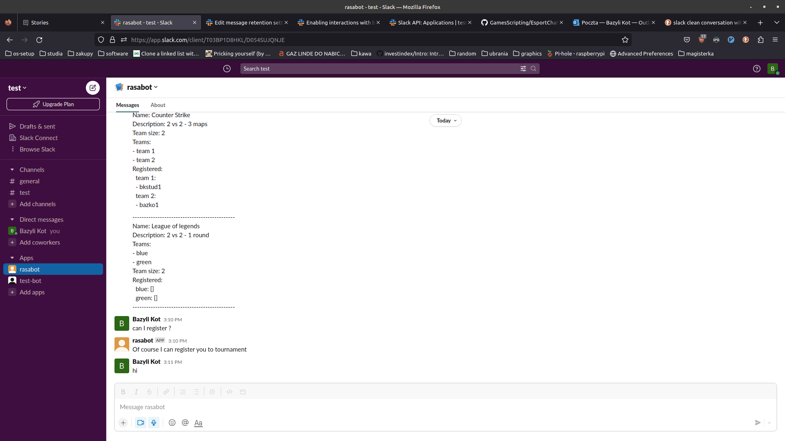

# Rasa chatbot tested with slack
## This chatbot has following features:
 - More than 3 stories + rules
 - This chatbot list tournaments and their details from json file `tournaments.json`
 - This chatbot has registration possibility for given tournament.
 - The `add.py` custom action handles registration - assigns player to random team and confirms successful registration
 - Listing all matches gives also information about teams.

## Demo
