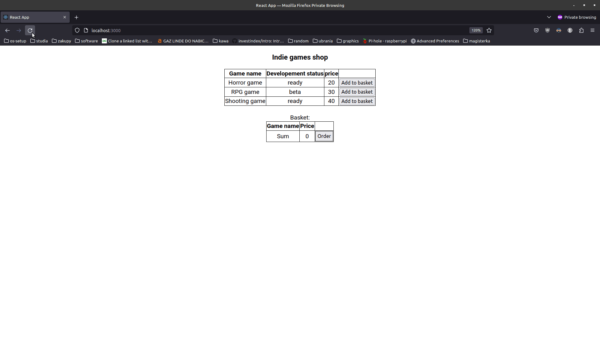

# GameShop

## Features:
- GET, POST endpoints for item getting and ordering
- Data saved in backend database Sqlite3
- Frontend uses Axios for GET, POST
- Basket and item listing works on React Hooks
- NodeJS backend has CORS configured (no need for front)

## Demo:
- Gif: 
